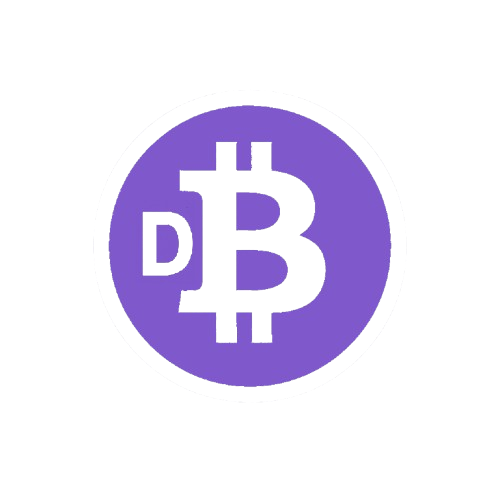

# DeflationaryDBTC (DBTC)

<p align="center">
  
</p>

<h1 align="center">DeflationaryDBTC (DBTC)</h1>
<p align="center">
  Next-Generation Deflationary Token & Ecosystem on Polygon
</p>

<p align="center">
  <a href="LICENSE"></a>
  <a href="https://soliditylang.org"></a>
  <a href="https://book.getfoundry.sh/"></a>
  <a href="https://polygon.technology/"></a>
  
</p>


## 📖 Overview
**DeflationaryDBTC (DBTC)** is an advanced ERC20 smart contract deployed on the **Polygon Mainnet**, designed to integrate **deflationary economics, staking, long-hold incentives, and automated liquidity mechanisms**.  
It is not a simple token but a **full-featured protocol** aimed at balancing scarcity, utility, and community-driven incentives.

## 📊 Deployed Contract Addresses:**  

Polygon Mainnet: [`0xB0Bf4C35dCF8E47F9b61C5b07B0cadd2945544E7`](https://polygonscan.com/address/0xB0Bf4C35dCF8E47F9b61C5b07B0cadd2945544E7)

Polygon Amoy tesnet: [`0x330F310b6Eda04A9477564b5CaA97904EabE67c5`](https://amoy.polygonscan.com/token/0x330f310b6eda04a9477564b5caa97904eabe67c5)

**📄 Whitepaper:**  
[Download DBTC Whitepaper v1.0 (September 2025)](https://dwjcrypto.com/pdf/DBTC_Whitepaper_v1.0.pdf)

### Key Design Goals
- **Scarcity through burns** – Supply reduction continues annually until the hard cap of 21M tokens is reached.  
- **Sustainability through fees** – Every transfer collects fees that are redistributed across the ecosystem.  
- **Incentivized holding & staking** – Rewards are aligned with long-term holding and staking.  
- **DAO governance ready** – DAO address can update governance parameters.  
- **Security-first** – Based on OpenZeppelin standards with `Ownable2Step`, `ReentrancyGuard`, and `Pausable` for safety.

---

## ✨ Core Features
- 🔒 **Staking & Long Holding:** Users can lock tokens (6 or 12 months) and earn proportional rewards.  
- 💧 **Liquidity Provider Incentives:** Automated redistribution for LP contributors.  
- 💰 **Fee Redistribution System:**  
  - 2% transaction fee → redistributed across stakeholders.  
  - **60%** Liquidity Providers  
  - **30%** Long Holders  
  - **10%** Stakers  
- 🔥 **Annual Burn:** Once per year, up to **50% of the supply exceeding the cap** is burned automatically until the target supply is reached.  
- 🛑 **Emergency Controls:** Contract can be paused/unpaused by the owner for risk mitigation.

---

## ⚙️ Tokenomics
- **Token Name:** DeflationaryDBTC  
- **Symbol:** DBTC  
- **Decimals:** 18  
- **Initial Supply:** `2,000,000,000 DBTC`  
- **Final Supply Cap:** `21,000,000 DBTC`  
- **Fee on Transfers:** 2%
- **DEX Liquidity (Uniswap + SushiSwap):** 	`700,000,000 	50%` 	
- **Burn Reserve:** 	`500,000,000 	35.7% 	300M` 
- **Team & Development:** 	`90,000,000 	6.4%` 	
- **Airdrop & Community:** `Rewards 	20,000,000 	1.4%` 	
- **Ecosystem Reserve:** 	`90,000,000 	6.4%` 	
---

## 🛠️ Development
This project is developed and tested with [**Foundry**](https://book.getfoundry.sh/).

### Install Foundry
```bash
curl -L https://foundry.paradigm.xyz | bash
foundryup

Build
```bash
forge build

Test
```bash
forge test -vv

deploy
```bash
forge script script/Deploy.s.sol --rpc-url $RPC_URL --private-key $PRIVATE_KEY --broadcast

✅ Security & Audit Notes

The contract has been tested and verified against:

✅ Access Control Validation
✅ Reentrancy Attacks
✅ Unchecked Transfer Risks
✅ Precision Loss in Division
✅ Annual Burn Logic
✅ DAO Update Governance Flow

All critical and high-severity issues resolved prior to deployment.

📂 Repository Structure

 ```bash
.
├── src/DBTC.sol              # Main smart contract
├── test/DBTC.t.sol           # Unit tests
├── script/Deploy.s.sol       # Deployment script
├── foundry.toml              # Foundry configuration
├── .github/workflows/ci.yml  # GitHub Actions (CI with Foundry)
└── README.md                 # Documentation

📜 License

MIT License
yaml

---
 DeflationaryDBTC (DBTC) – Risk Clarification Report
 Overview 👇

Following an automated scan by De.Fi, several “High Risk” issues were flagged for the DeflationaryBTC smart contract.
After a full technical review, we confirm these are false positives.
Below is a detailed clarification for each item.

🔒 1️⃣ Pausable (High Risk – False Positive)

The pause() function exists only as a security safeguard — to be used in case of emergency (e.g., exploit detection or malfunction).

It does not grant arbitrary control over transfers.

The implementation follows OpenZeppelin best practices, the same framework used by major projects like USDC, AAVE, and Compound.

✅ Reality: Security measure, not a risk.

💸 2️⃣ Transfer Fee (Critical – False Positive)

The audit flagged a “fee mechanism” but misinterpreted it.

DBTC applies a fixed 0.2% transaction fee, transparently split 50/50 between the DAO and the Treasury.

The fee value is immutable — there is no function to modify it after deployment.

✅ Reality: Transparent, immutable, and deflationary system.

💧 3️⃣ Missing Liquidity (High Risk – False Positive / Temporary)

De.Fi couldn’t detect liquidity pairs because the token is newly deployed and currently in the pre-market phase.

As soon as liquidity is added on DEX platforms (e.g., Uniswap, SushiSwap), this flag will automatically disappear.

✅ Reality: Normal for new tokens before public listing.

👥 4️⃣ Whitelisting (Attention Required – False Positive)

No active or dynamic whitelist exists in the contract.

The scanner mistakenly identified internal exclusions (e.g., isExcludedFromFee) used only to prevent double taxation during internal DAO or contract transfers.

✅ Reality: No central control, only internal safety logic.

 Summary

“All issues flagged by De.Fi are standard protective or deflationary mechanisms, not vulnerabilities.
The DBTC contract uses OpenZeppelin libraries, an immutable 0.2% fee distributed between DAO and Treasury, and a Pausable mechanism strictly for emergency protection.
No whitelists or privileged addresses exist, and all operations are fully transparent and verifiable on-chain.”
